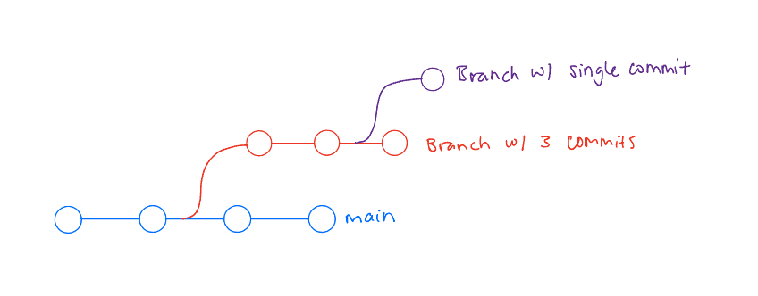

## Question 1: What is the difference between git and GitLab?

Git is a version control system that manages code changes locally and remotely, while GitLab is a web-based Git repository hosting service.

## Question 2: What is the difference between GitLab, GitHub, and BitBucket?  

GitLab, GitHub, and Bitbucket are all platforms for hosting Git repositories online.

GitLab provides tools for managing code, tracking issues, and automating development processes. It can also be installed on a private server.

## Question 3: Why would I ever want to use git, but not GitLab?

You might want to use Git without GitLab if you only need local version control and do not need online hosting or collaboration features. Git allows you to track changes, manage branches, and revert to previous versions entirely on your own computer. This is useful for personal projects, offline work, or when using another Git hosting service like GitHub or Bitbucket instead of GitLab.

## Question 4: What are the steps to update the GitLab server with some changes I made on my computer?

Step 1: Check for the latest updates by pulling changes from the GitLab repository to ensure your local copy is up to date.

Step 2: Add the changes you made to the staging area.

Step 3: Commit your changes with a clear message describing what you updated.

Step 4: Push the changes to the GitLab server to update the repository online.

## Question 5: What is a branch and why would I use one?

A branch is an independent line of development which is used to make changes to the main in a stable and clean way. Branches allow for changes to be to the main code seperately and then pushed to the main code to implement these changes once the code in the branch is satisfactory, which prevents messy code from affecting the main branch. Branches also allow for multiple users to work on multiple features at the same time without effecting the main code or one anothers branches. 

## Question 6: How could you visualize a branch with 3 commits, and then another branch that breaks off after the second commit and has a single commit?

## Question 7: Give an example of a set of git commands that would result in a merge conflict.

If two users were to edit the same piece of code within the main and try to push their changes before pulling the others changes, a merge conflict would occur. This is because the second user who is trying to push has made changes to an outdated version of the main since they have not pulled the others changes first. 

## Question 8: Is Git suitable for latex documents?

Yes, Git is suitable for latex documents. 

## Question 9: Should I from now on version my word and powerpoint slides using git? Why/why not?

I could use it as changes of a document can be tracked over time and reverted to earlier versions if needed and VCS enables multiple people to work on the same files without overwriting each other's changes. However, due to poor handling of Binary Large Objects, PowerPoint presentations with images/videos can become large, making Git slow and inefficient.

## Question 10: What could happen when I push my latest commit to the remote repository without pulling first?

If my local branch is up to date, my push will succeed without any issues and the remote branch will simply be updated with my new commit, but if there are new commits in the remote branch without pulling first, my push will be rejected with an error message.

## Question 11: What happens when I pull without commiting my local changes first?

There are two possibilities:
In the first one Git will merge the remote changes with my local changes and my uncommitted changes will remain, and Ι can continue working.
In the second one, Git will stop the pull and show an error message in which cannot merge files that have both local and remote changes.

## Question 12: What is the difference between branching and forking?

Both allow you to work on changes independently, but Branching is used within the same repository, creates a lightweight copy of the project inside the same repo and is good for feature development, bug fixes, or experiments, while Forking creates a completely independent copy of a repository, is used to contribute to open-source projects or modify projects without affecting the original repo and is ideal for working on projects you don’t have direct write access to.

